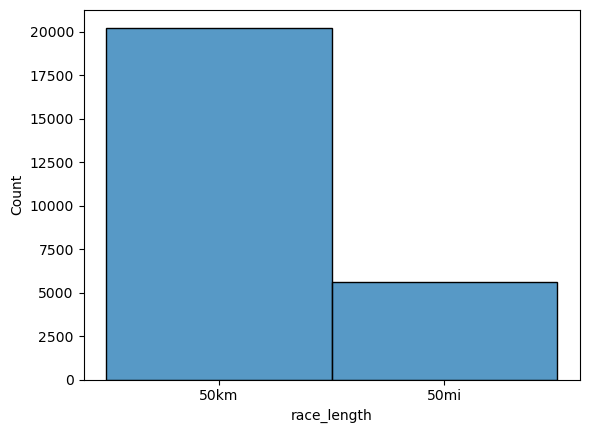
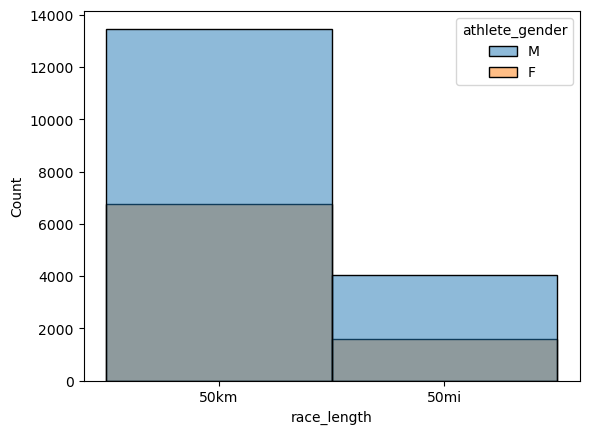
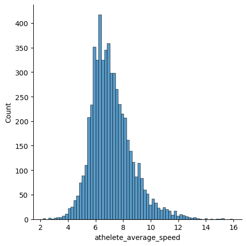
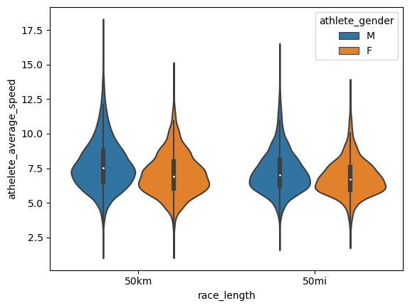
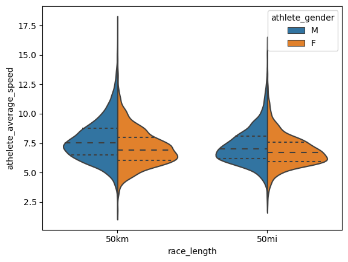
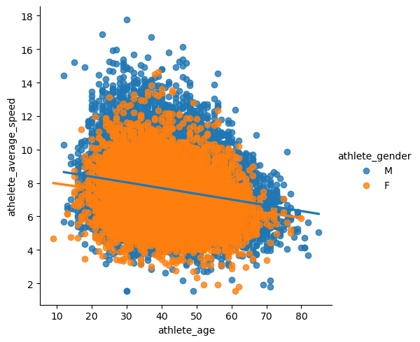

# data_analysis_Python

Dataset : Kaggle dataset "The big dataset of ultra-marathon running" used. 
**https://www.kaggle.com/datasets/aiaiaidavid/the-big-dataset-of-ultra-marathon-running?resource=download**

**The data in this file is a large collection of ultra-marathon race records registered between 1798 and 2022**
**Despite the original data being of public domain, the race records, which originally contained the athlete´s names, have been anonymized to comply with data protection laws and to preserve the athlete´s privacy. However, a column Athlete ID has been created with a numerical ID representing each unique runner (so if Antonio Fernández participated in 5 races over different years, then the corresponding race records now hold his unique Athlete ID instead of his name).**

01.Clean up the data using python
- for data only USA, 50km or 50miles in year 2020
-  athlete age
-  drop columns: Athlete club, Athlete country, athlete year of birth, athlete age category
-  check for duplicate values
-  fix data types
-  rename columns
-  reorder columns

02.Charts and Groups 
03. querris

